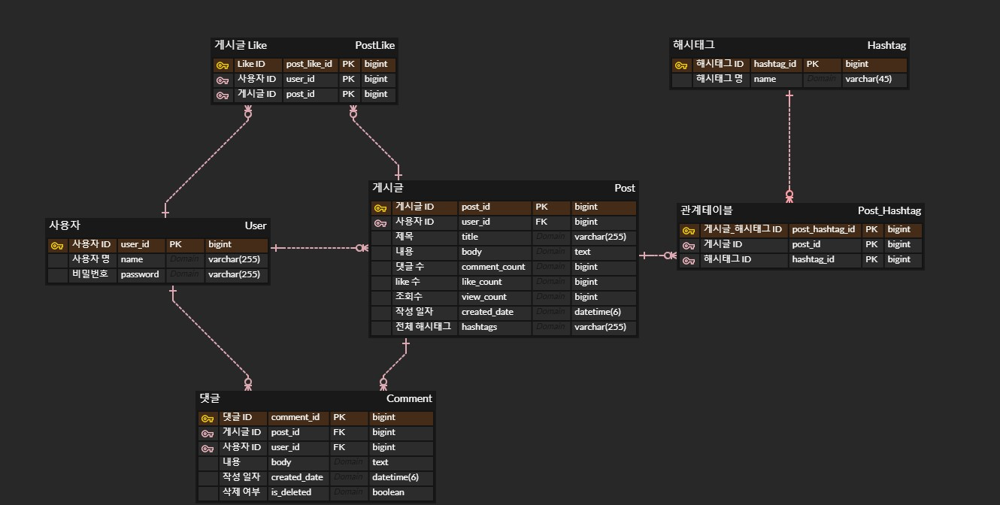
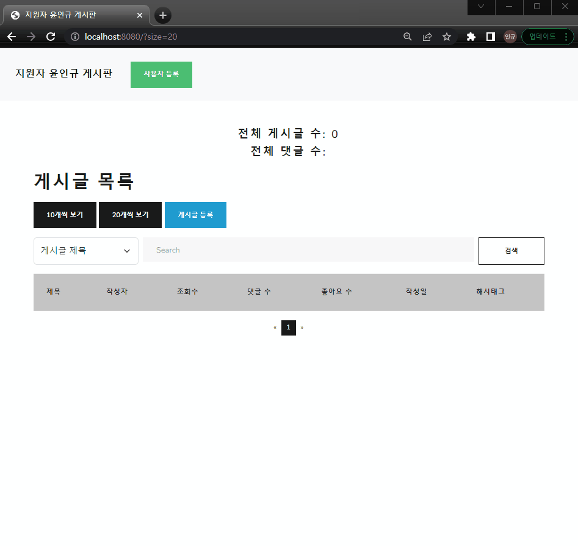
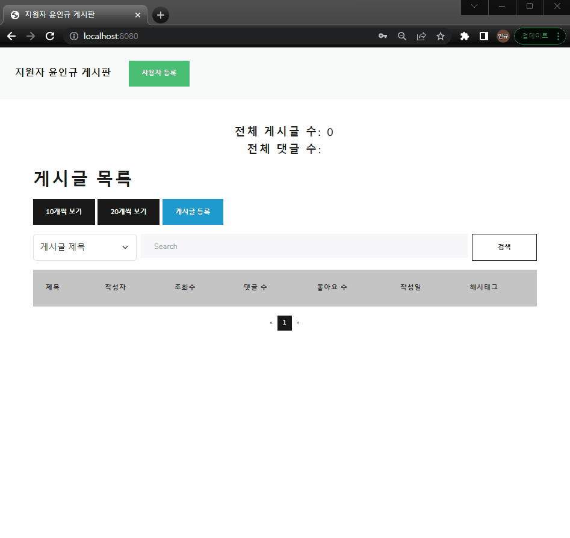
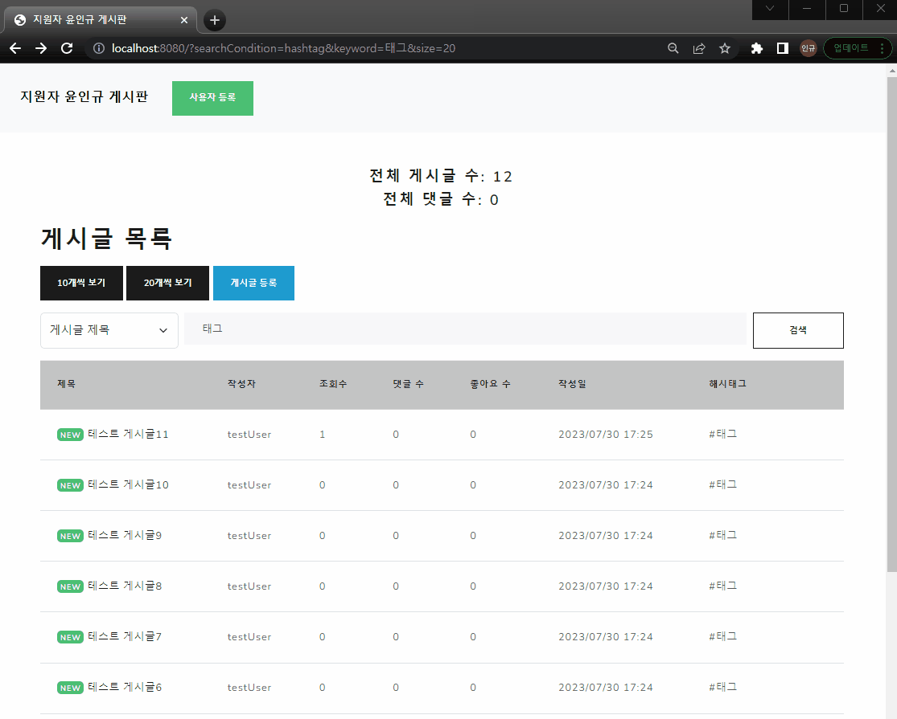
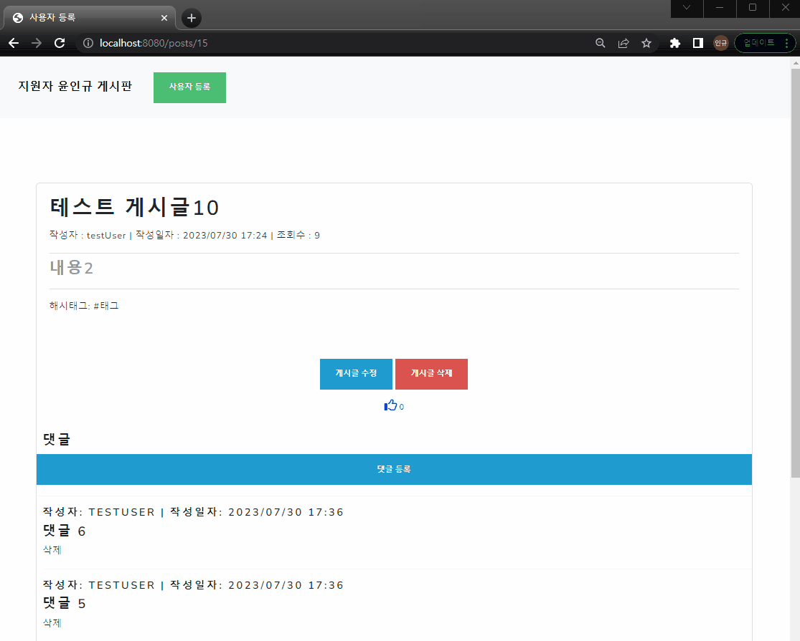
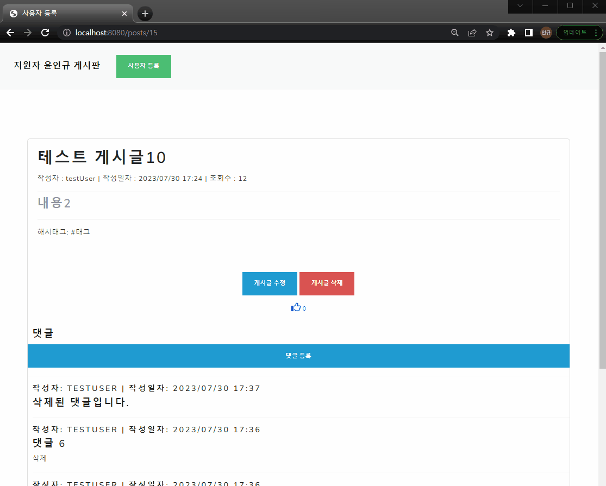

# 게시판 구현하기 프로젝트

## 개발 환경

Java 17 · SpringBoot 3.1.2 · MySQL 8.0 · Spring Data JPA · Lombok · Querydsl · Thymeleaf · Axios

## 프로젝트 실행 가이드


1. mysql에 접속한 뒤, [ddl.sql](https://github.com/inkyu-yoon/nts-YoonInKyu/blob/main/ddl.sql) 파일을 실행시킵니다.
2. 스키마 명은 `nts-inkyu` 로 생성됩니다.
3. [application.yml](https://github.com/inkyu-yoon/nts-YoonInKyu/blob/main/src/main/resources/application.yml) 파일의 `password` 부분에 본인이 사용하는 mysql password를 입력합니다.
4. 프로젝트를 실행한 뒤, [접속](http://localhost:8080/)합니다.
5. [Swagger 문서](http://localhost:8080/swagger-ui/index.html#/)


## 요구 사항

화면 구성 제약은 없으며, 요구 사항 중 최소 10가지 기능 을 완료해주세요.
```
1. 사용자는 게시글과 댓글을 읽을 수 있다.
2. 사용자는 게시글과 댓글을 작성할 수 있고, 텍스트만 가능하다.
3. 본인이 작성한 게시글은 수정 또는 삭제할 수 있다.
4. 본인 확인을 위한 비밀번호는 암호화하여 DB에 저장한다.
5. 게시글에는 해시태그 최대 5개를 등록할 수 있다.

6. 게시글 목록 화면에는 게시글 전체건수와 댓글 전체건수를 표시한다.
7. 게시글 목록에는 제목, 작성자, 작성일시, 댓글 수, 조회수, 좋아요수를 표시한다.
8. 게시글 목록에서 제목, 작성자, 해시태그, 내용을 선택하여 문자열을 검색할 수 있다.
9. 게시글 목록은 최신순으로 10개 또는 20개씩 페이징 처리한다.
10. 댓글은 게시글 본문 하단에 최신 5건을 노출하고, 5건씩 `더 보기`로 과거 댓글을 조회할 수 있다.

11. 게시글 목록에서 최근 3일 이내 등록된 글은 [New] 텍스트를 붙여 식별할 수 있다.
12. 게시글 목록에서 제목을 클릭하면 게시글 상세로 이동하고, 조회수를 갱신하고 건수를 확인할 수 있다.
13. 게시글 상세에서 `Like` 또는 `unlike`를 할 수 있고, Like 건수를 표시한다.
14. 삭제 처리된 댓글은 `삭제된 댓글입니다.`라고 내용 대신 메시지를 노출한다.

```

## ERD



### 📌 erd 설계 과정

#### 1. User

`User`의 경우 요구사항에 따라, `사용자 명` · `비밀번호` 만 필요한 것으로 판단했습니다.

#### 2. Post

`Post`의 경우 `User` 가 여러 개의 `Post`를 작성할 수 있으므로 `User` 엔티티와 1대 다 관계에 있습니다.

따라서, 외래키로서 `User` 엔티티의 기본키를 갖습니다.

또한, 요구사항에 따라 `제목` · `내용` · `작성일자` · `조회수` 를 표시해야하므로 해당 칼럼들이 필요합니다.

요구사항에 의하면 `댓글 수` 와 `조회수` 를 표시해야하는데, 

`Post`와 연관 관계를 이루는 `Comment` 혹은 `Like` 의 개수를 count 하는 질의를 매번 날리기 보다는 

칼럼으로서 갖고 있으면 성능에 더 유리하다고 판단되어 추가했습니다.

또한, 게시글 목록에 해시태그를 보여주기 위해, 해시태그를 하나의 문자열로 결합하여 보관하는 문자열 속성 hashtags를 추가했습니다.

#### 3. Comment

댓글은 `내용`이 포함되어야 하고, 최신순으로 정렬하기 위해서 `작성일자`가 필요합니다.

또한, 삭제 시 `삭제된 댓글입니다.` 가 표시되어야 하는데

삭제 요청 시 댓글 내용을 업데이트 하는 방법과 삭제 여부를 확인하는 칼럼을 추가하는 방법 중 고민했습니다.

단순 삭제를 위한 기능이었다면, 굳이 `삭제된 댓글입니다.` 표시 대신 제거하는 방법을 사용했을 것이라 생각이 들었습니다.

따라서, 삭제 전 원본 댓글을 데이터 베이스에 보관하는 방법이 맞다고 판단하였습니다.

#### 4. PostLike

게시글 `Like` 엔티티입니다.

요구사항의 [unlike] 기능은 싫어요 입력 기능이 아닌, 입력했던 like를 취소하는 기능으로 판단하였습니다.

따라서, 게시글별 사용자의 like 입력 여부를 확인해야하기 때문에 엔티티로 분리하였습니다.

#### 5. Hashtag 와 Post_HashTag

`Hashtag` 와 `Post` 관계는 다대다 관계이므로 관계테이블을 두어 1대다 관계로 해소하였습니다.

요구사항에 따르면 `Hashtag`의 수는 최대 5개로 가변적이며 재 사용될 수 있음을 고려하여 엔티티를 분리하였습니다.


## 시연

### 사용자 등록



사용자 등록 버튼을 클릭하면 사용자 정보를 등록할 수 있으며, 이미 등록된 사용자명으로 요청은 불가합니다.

### 게시글 등록




등록된 사용자는 게시글 등록 버튼을 눌러 게시글을 작성할 수 있으며, 태그를 입력할 수 있는 칸은 최대 5칸이 생성됩니다.

### 게시글 목록 글 개수 설정 및 검색 기능


게시글 목록 화면에서 불러오는 게시글을 10개 또는 20개 단위로 선택할 수 있습니다.

게시글 제목, 내용, 작성자명, 해시태그로 검색할 수 있으며

게시글 제목, 내용, 작성자명은 검색한 키워드가 포함되는 경우가 반환되며

해시태그는 완전히 일치하는 게시글만 반환됩니다.

### 게시글 상세 조회 및 게시글 수정 및 삭제



게시글 목록에서 제목을 클릭하면 상세 화면을 확인할 수 있습니다.

상세 화면에서 수정 또는 삭제를 할 수 있고, 작성자의 비밀번호를 입력하는 경우에만 가능합니다.

### 댓글 조회, 등록 및 삭제



등록된 사용자는 댓글을 입력할 수 있으며, 본인의 댓글은 비밀번호를 입력하여 삭제할 수 있습니다.

삭제된 댓글은 `삭제된 댓글입니다.` 표시로 바뀝니다.

댓글은 기본적으로 5건을 보여주고 더보기 버튼을 누른 경우 5건을 더 보여줍니다.

더 보여줄 댓글이 없는 경우 사라집니다.

### 좋아요 기능



등록된 사용자는 게시글 좋아요를 할 수 있으며, 이미 좋아요를 눌렀던 사용자는 입력했던 좋아요가 취소됩니다.
